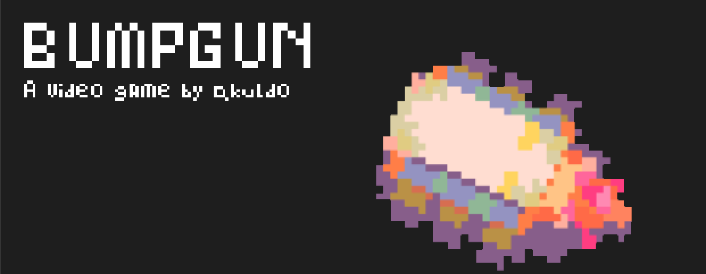

# Bumpgun

## About
**Bumpgun** is a simple, arcade-style, rougelite where you explore 4 Infestations filled with monsters using a **SMED** _(Specialized Monster Eradication Drone)_ and obtain items that help you upgrade your SMED, and even unlock new SMEDs with specialized mechanics to help you explore the Infestation sites.
## Requirements
* **Python Version**: Version `3.11.9` or higher
* **Required Packages**:
	* Pygame `2.6.0` or higher
## Contributing
Guidelines for contributing can be found [here](CONTRIBUTING.md).
## License
This project is under the [GNU General Public License](LICENSE.md)